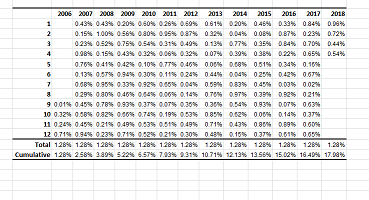

# Personal.xlsb
A collection of utility functions of Excel plugin. 

## Range Alignment Tool
A tool to align two ranges based on given columns. This impliments a full join function basing on a single column in any two given excel range.
To use this tool, import the RangeAlignmentTool.frm, RangeAlignmentTool.frx, and AlignTwoBlockBasedonGivenRange.bas

## Quick Format Tool
A tool quickly formats a given range. If no range is selected, it will format the used range.
* It tries to guess dates
* It tries to guess percentage values but not very good at it
* It assumes there is an header
* It replaces NULL with blank string

## Merge Selected Range Tool
It merges cells (row-wise) if they contains the same value. It is useful when copied data from database with the first several columns are sorted catagorical values.

## Insert Performance Table
A tool to quickly convert a monthly performance table column to a presentable table

The inserted tabel looks like this:

